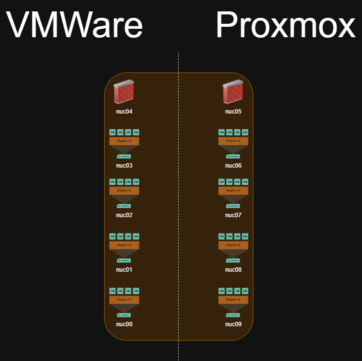
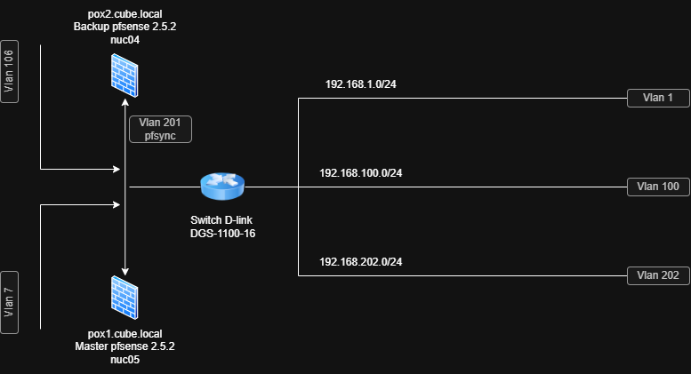

# kio01-DAT

## kio01 physical architecture

The kio01 box is composed of 10 Intel® NUC D53427RKE

## kio01 network-architecture

## Vlan description

- `Vlan 7` is an internal management Vlan
- `Vlan 106` is a production Vlan 
- `Vlan 1` is the Intel AMT management Vlan
- `Vlan 100` is the hypervisors management Vlan
- `Vlan 202` is dedicated for virtual machines
- `Vlan 201` is the dedicated pfsync Vlan

## Vlan 1 - AMTLAN

- `Vlan 1` is the Intel AMT management Vlan

### Subnet IPV4

- `192.168.1.0/24`

### Hosts

| IP Address | Host | Description |
|------------|------|-------------|
|`192.168.1.1`|Firewall AMTLAN VIP gateway| This Firewall|
|`192.168.1.2`|Firewall AMTLAN Master| This Firewall|
|`192.168.1.3`|Firewall AMTLAN Backup| This Firewall|
|`192.168.1.10`|nuc00.cube.local| nuc 0 Intel AMT |
|`192.168.1.11`|nuc01.cube.local| nuc 1 Intel AMT |
|`192.168.1.12`|nuc02.cube.local| nuc 2 Intel AMT |
|`192.168.1.13`|nuc03.cube.local| nuc 3 Intel AMT |
|`192.168.1.14`|nuc04.cube.local| nuc 4 Intel AMT |
|`192.168.1.15`|nuc05.cube.local| nuc 5 Intel AMT |
|`192.168.1.16`|nuc06.cube.local| nuc 6 Intel AMT |
|`192.168.1.17`|nuc07.cube.local| nuc 7 Intel AMT |
|`192.168.1.18`|nuc08.cube.local| nuc 8 Intel AMT |
|`192.168.1.19`|nuc09.cube.local| nuc 9 Intel AMT |

## Vlan 100 - LAN

- `Vlan 100` is the hypervisors management Vlan

### Subnet IPV4

- `192.168.100.0/24`

### Hosts

| IP Address | Host | Description |
|------------|------|-------------|
|`192.168.100.1`|Firewall LAN VIP gateway| This Firewall|
|`192.168.100.2`|Firewall LAN Master| This Firewall|
|`192.168.100.3`|Firewall LAN Backup| This Firewall|
|`192.168.100.6`|D-Link Series DGS-1100-16| D-Link switch|
|`192.168.100.10`|cb0.cube.local| VMWare esxi |
|`192.168.100.11`|cb1.cube.local| VMWare esxi |
|`192.168.100.12`|cb2.cube.local| VMWare esxi |
|`192.168.100.13`|cb3.cube.local| VMWare esxi |
|`192.168.100.16`|cb6.cube.local| Proxmox VE |
|`192.168.100.17`|cb7.cube.local| Proxmox VE |
|`192.168.100.18`|cb8.cube.local| Proxmox VE |
|`192.168.100.19`|cb9.cube.local| Proxmox VE |
|`192.168.100.200`|nucAdmin| Intet AMT MeshCentral remote controller and Hype Manager |

## Vlan 202 - VMLAN

- `Vlan 202` is dedicated for virtual machines

### Subnet IPV4

- `192.168.202.0/24`

### Hosts

| IP Address | Host | Description |
|------------|------|-------------|
|`192.168.202.1`|Firewall VMLAN VIP gateway| This Firewall|
|`192.168.202.2`|Firewall VMLAN Master| This Firewall|
|`192.168.202.3`|Firewall VMLAN Backup| This Firewall|
|`192.168.202.12`|demo-ws4| abcdesktopio demo worker |
|`192.168.202.13`|demo-ws5| abcdesktopio demo worker |
|`192.168.202.14`|demo-ws6| abcdesktopio demo worker |
|`192.168.202.15`|demo-cp1| abcdesktopio demo control-plane |
|`192.168.202.16`|demo-ws1| abcdesktopio demo worker |
|`192.168.202.17`|demo-ws2| abcdesktopio demo worker |
|`192.168.202.18`|demo-ws3| abcdesktopio demo worker |
|`192.168.202.22`|demo-cp2| abcdesktopio demo control-plane |

## Vlan 201 - SYNC

- `Vlan 201` is the dedicated pfsync Vlan

### Hosts

| IP Address | Host | Description |
|------------|------|-------------|
|`192.168.201.2`|Firewall SYNC Master| This Firewall|
|`192.168.201.3`|Firewall SYNC Backup| This Firewall|